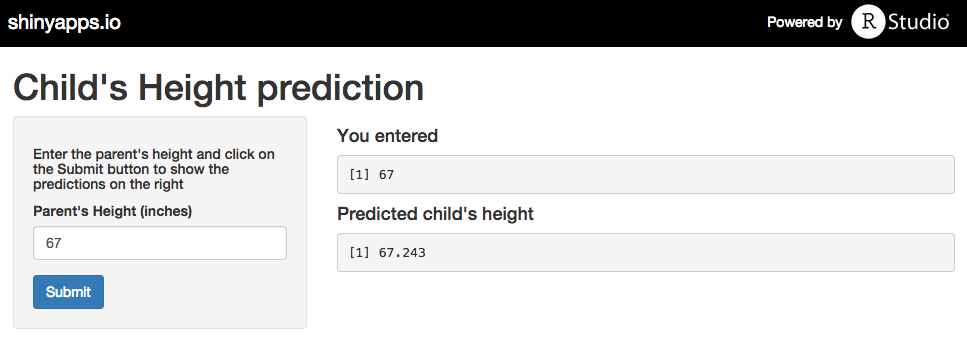

Curious about your future child's height? 
========================================================
author:  Jayson Cheng
date: 20/06/2015


Background
========================================================

Galton (1886) presented the data of 928 adult children born to 205 fathers and mothers, by their height and their mid-parent's height. These data is still fairly accurate today in predicting child's height, given parent's height.

Additional information about the dataset
========================================================


```r
library(HistData)
summary(Galton)
```

```
     parent          child      
 Min.   :64.00   Min.   :61.70  
 1st Qu.:67.50   1st Qu.:66.20  
 Median :68.50   Median :68.20  
 Mean   :68.31   Mean   :68.09  
 3rd Qu.:69.50   3rd Qu.:70.20  
 Max.   :73.00   Max.   :73.70  
```

Predicting your child's height
========================================================

Do you have a young child or are you an expecting parent curious to find out your future child's height?

The Child Height Prediction application can give you a estimation. 

Usage
========================================================

Using the application is simple. Just input your height and click on the submit button.

The estimation will be shown on the right pane.


